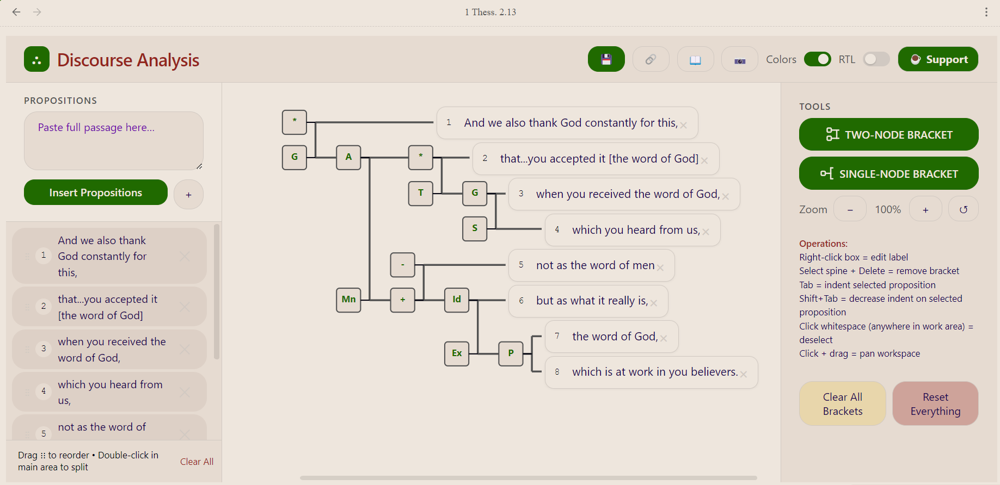

# Discourse Analysis Tool

Create and edit visual discourse-analysis bracket diagrams for biblical texts, natively in your vault. This plugin adds a new file type — `.da` — that Obsidian opens in a dedicated diagramming view, so a passage's discourse structure lives alongside your other sermon-prep notes and syncs with the rest of your vault.

Prefer the browser? The same tool runs as a free web app at **[sots1689.github.io/DA-Tool](https://sots1689.github.io/DA-Tool/)** (no install; save a project as a standalone HTML file).

## What it does

Discourse analysis (also called phrasing or bracketing) is a method of visually mapping how the clauses/propositions of a biblical passage relate to one another — main lines, subordination, logical relationships (ground, purpose, contrast, etc.) — using nested brackets. The tool is organized into three tabs that follow the exegetical workflow:

### Brackets

- Paste in a passage and split it into individual propositions. Verse numbers are detected automatically — line-prefixed, superscript, or embedded mid-sentence — along with passage references in headers, trailers, and citations
- Propositions are numbered by verse (5a, 5b, 5c…). Splitting or inserting re-letters the verse group in order, drag-reordering keeps labels intact, and any label can be clicked to edit by hand
- Double-click a proposition to split it at the exact click point
- Connect propositions with two-node or single-node brackets; nesting depth is computed automatically so brackets never cross
- Label brackets with logical relationships, with a built-in reference for the 18 common relationship types
- Double-click a bracket's label box to mark it as the passage's **main point** (shown in a distinct color)
- Indent/outdent, drag-and-drop reorder, and undo/redo your edits
- Zoom controls and a right-to-left mode for Hebrew text
- Export the diagram as a PNG saved directly into your vault

### Text Flow

A Word-like canvas for laying out a whole Greek passage clause by clause — independent clauses left-justified, dependent clauses indented — as preparation for discourse analysis. An **Instructions** button opens Blake Franze's *Text Flow Instructions* (v1.6) right inside the tool, with guidelines and worked examples (Matt 8:23–29, 1 John 1:5–10).

### Sentence Flow

The same canvas, kept separately, for grammatically breaking down individual complex sentences.

Both flow tabs support:

- Tab-aligned columns via a configurable default tab stop; Ctrl+M / Ctrl+Shift+M indent the whole line
- New lines keep the previous line's indent, so you can flow a passage with just Enter and Tab
- Bold, italic, and underline
- Plain-text paste (tabs are preserved as tab stops)
- Their own independent zoom level
- Correct rendering of polytonic Greek accents

### Customization (Obsidian)

- Optionally adopt your Obsidian theme's colors, or pick custom colors for panels, brackets, selection, and the main-point highlight in the plugin settings

Everything is stored as plain JSON inside the `.da` file itself, so diagrams are portable, diffable, and work with whatever sync method you already use for your vault (Obsidian Sync, git, etc.).

## Example

A discourse analysis diagram for 1 Thessalonians 2:13, showing nested brackets with logical relationship labels (G = ground, A = action, T = temporal, etc.):



## Usage

1. Click the bracket icon in the ribbon (or run **Create new Discourse Analysis** from the command palette) to create a new `.da` file and open it in the diagram view.
2. Optionally start in the **Text Flow** tab: paste the Greek text and flow it clause by clause with Enter and Tab (click **Instructions** for the guidelines).
3. On the **Brackets** tab, paste your passage into the Propositions panel and click **Insert** to split it into verse-labeled rows. Double-click any row to split it further.
4. Select one or more propositions, then use **Add Two-Node Bracket** or **Add Single-Node Bracket** to connect them.
5. Right-click a bracket's label box to set its logical relationship; double-click it to mark the main point.
6. Drag rows in the sidebar to reorder propositions, use Tab/Shift+Tab to indent/outdent, and Delete to remove a selected item.
7. Use the export button to save a PNG snapshot of the diagram next to your `.da` file.

The file saves automatically as part of Obsidian's normal save behavior — there's no separate "save project" step.

## Known limitations

- Visual styling is a hand-ported, reasonable-fidelity approximation of the original web tool's look, not a pixel-perfect reproduction.
- No automated test suite; changes are verified through manual testing.

## Development

```bash
cd obsidian-plugin
npm install
npm run dev    # esbuild watch mode
npm run build  # production build
```

See the source in [`obsidian-plugin/src/`](obsidian-plugin/src/) — `main.ts` registers the `.da` view, commands, and settings, `DAView.ts` contains the diagramming engine and flow canvases. The web app is the single self-contained [`index.html`](index.html).

## Credits

*Text Flow Instructions* (v1.6) by Blake Franze.

## License

[MIT](LICENSE)
